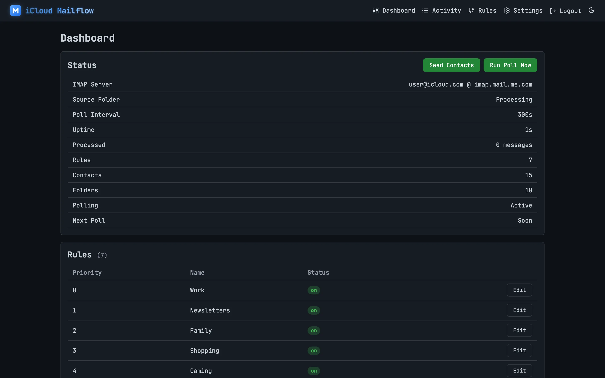
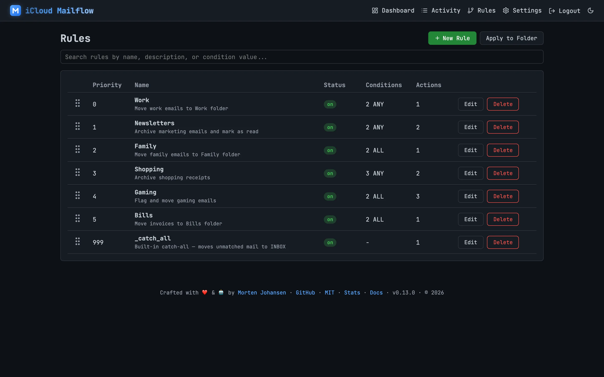
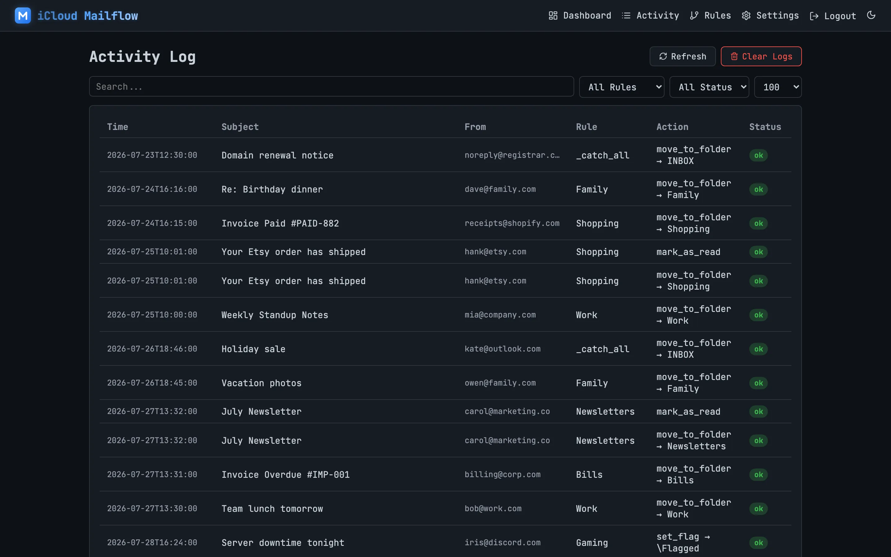
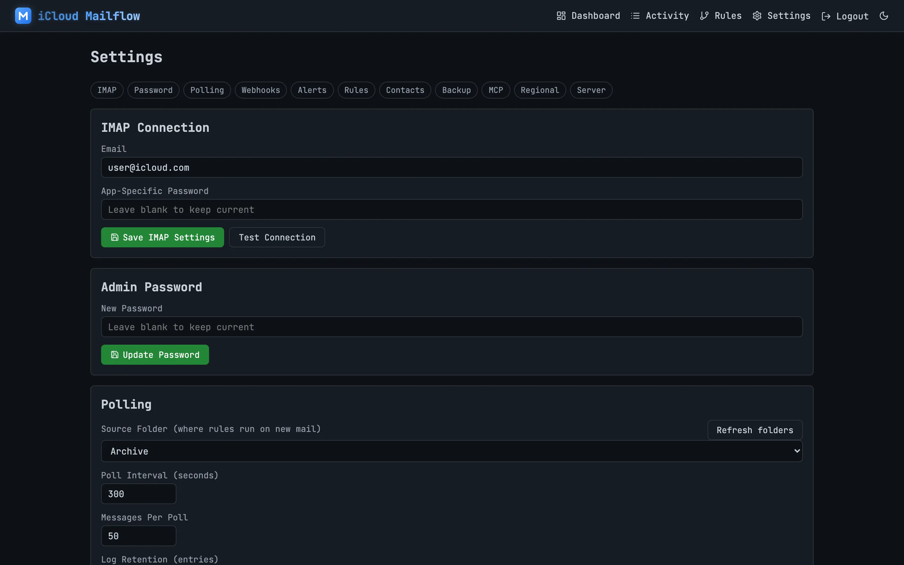
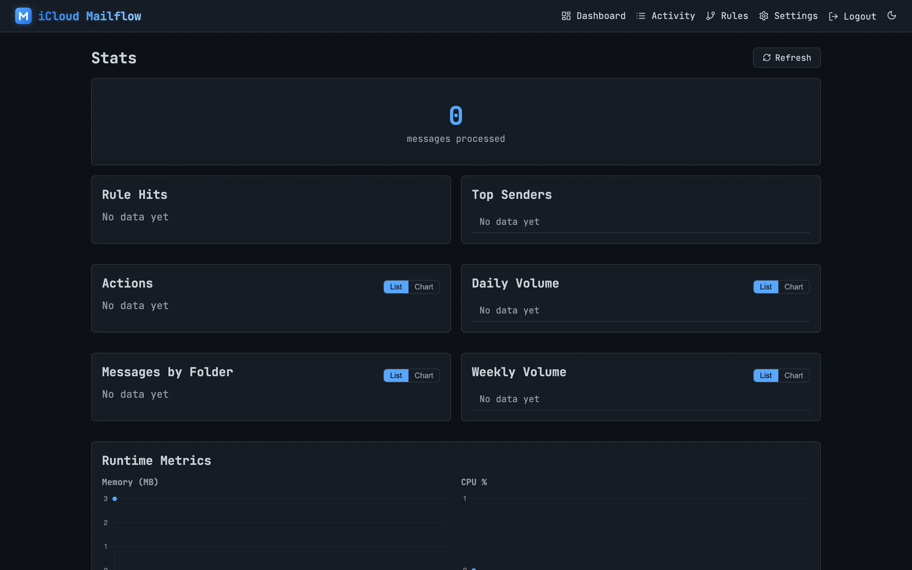
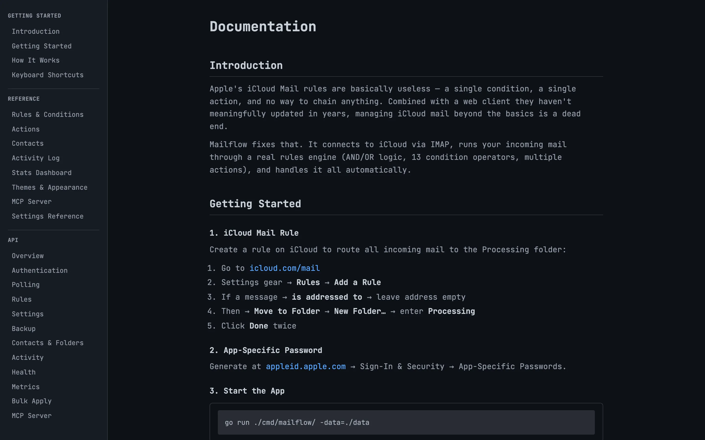

# iCloud Mailflow

Apple's iCloud Mail rules are basically useless — a single condition, a single action, and no way to chain anything. Combined with a web client they haven't meaningfully updated in years, managing iCloud mail beyond the basics is a dead end.

Mailflow fixes that. It connects to iCloud via IMAP, runs your incoming mail through a real rules engine (AND/OR logic, 10 condition operators, multiple actions), and handles it all automatically. Everything Apple should have built, running on your own machine.

## Features

- **IMAP Rules Engine** — match messages by from/to/cc/subject/attachment with AND/OR logic, execute actions (move to folder, mark as read, mark as unread, set flags)
- **Drag & Drop Rule Reorder** — reorder rules via drag-and-drop on the rules page
- **CardDAV Contacts Import** — import contacts from iCloud address book
- **Email Contact Collection** — automatically extract contacts from processed messages
- **Contact Autocomplete** — contacts suggest in rule condition value inputs
- **Rules Export/Import** — backup and restore rule configurations as JSON
- **Activity Log** — see every rule match and action result with timestamps
- **Stats Dashboard** — rule hit counts, top senders, actions breakdown, daily volume
- **Docs Page** — full usage guide and API reference with curl examples and syntax highlighting
- **Light/Dark Theme** — toggle in the nav bar, respects OS preference on first visit
- **JetBrains Mono Font** — optional monospace font, toggle in Settings → Regional
- **Timezone Support** — display activity log in your local timezone
- **Folder Auto-Create** — source folder is created on iCloud if it doesn't exist
- **Test Connection** — verify IMAP credentials before saving
- **Configurable Polling** — adjustable batch size, interval, and on/off toggle
- **Log Retention** — configure how many activity entries to keep
- **Server Metrics** — uptime, memory, and server time in Settings

### Security
- IMAP password encrypted at rest with AES-256-GCM
- CSRF protection on all forms
- Rate-limited login (5 attempts/minute/IP)
- bcrypt hashed admin password
- SameSite=Strict session cookies

## Screenshots

| Dashboard | Rules | Activity |
| :-------: | :---: | :------: |
|  |  |  |
| **Settings** | **Stats** | **Docs** |
|  |  |  |

## How It Works

```
Incoming mail → iCloud Rule → "Processing" folder → Mailflow poller → Match rules → Execute actions
```

1. Create an iCloud mail rule that moves all incoming mail to a "Processing" folder (see below)
2. Mailflow polls the Processing folder every 300 seconds (5 minutes, configurable in Settings)
3. Each message is checked against your rules (first match wins)
4. Matched actions execute: move to folder, mark as read, etc.
5. Unmatched messages fall through to the catch-all rule

## Quick Start

### 1. Configure iCloud Mail

Create a rule on iCloud to route mail to the Processing folder:

1. Go to [icloud.com/mail](https://www.icloud.com/mail)
2. Click the settings gear ⚙ → **Rules** → **Add a Rule**
3. Set "If a message" → **is addressed to** → leave the address field empty (matches all)
4. Under "Then" → **Move to Folder** → choose **New Folder...** → enter **Processing**
5. Click **Done** → **Done**

All new incoming mail will now land in the Processing folder.

### 2. Start Mailflow

```bash
go run ./cmd/mailflow/ -data=./data
```

Open http://127.0.0.1:8080/setup — configure your admin password and iCloud app-specific password.

### 3. Create your first rule

1. Go to **Rules** → **+ New Rule**
2. Add a condition (e.g. `from contains @work.com`) with **ALL** or **ANY** matching
3. Add an action (e.g. `Move to Folder → Work`)
4. Save

The rule runs immediately on the next poll tick. Click **Run Poll Now** to trigger manually.

## Docker

```bash
docker compose up -d
```

Then open http://127.0.0.1:8080/setup to configure IMAP. After saving, restart the container so IMAP reconnects:

```bash
docker compose restart
```

The image is automatically built and pushed to `ghcr.io/mojoaar/icloud-mailflow` on every version tag.

To build locally instead:
```bash
docker build -t icloud-mailflow .
```

## Demo

A demo database with sample data (rules, contacts, activity log) is available for testing and screenshots:

```bash
rm -f demo/mailflow.db* && bash scripts/demo.sh && go run ./cmd/mailflow/ -data=./demo
```

Then open http://localhost:8080/dashboard and log in with password `demo123`.

## Build Requirements

- Go 1.25+
- No CGO (pure Go SQLite via modernc.org/sqlite)

## Stack

| Component   | Technology                                                |
| ----------- | --------------------------------------------------------- |
| Language    | Go 1.25+                                                  |
| HTTP Router | chi v5                                                    |
| Database    | SQLite (modernc.org/sqlite)                                |
| IMAP        | go-imap v2                                                |
| CardDAV     | go-webdav/carddav                                         |
| Frontend    | HTMX + html/template, no JavaScript framework             |

## Architecture

```
cmd/mailflow/     — entry point
internal/
  config/         — JSON config file
  crypto/         — AES encrypt/decrypt + bcrypt
  db/             — SQLite + migrations + repositories
  imap/           — IMAP client (go-imap v2)
  rules/          — rule evaluation engine
  contacts/       — contact collector from email headers
  carddav/        — iCloud CardDAV contacts importer
  poller/         — periodic email polling
  web/            — chi router, auth, handlers, templates
```

## Known Issues

### iCloud Web Session Expiry
Using the iCloud web mail client (mail.icloud.com) while Mailflow is polling may cause the web session to expire. This is Apple's session management, not a bug. Workarounds:
- Set a longer poll interval (300s+ recommended) in Settings
- Disable polling via the toggle in Settings while actively using iCloud web mail
- Use separate browsers for iCloud web and Mailflow

## Credits

### Go Libraries

| Library | Use | License |
| ------- | --- | ------- |
| [go-imap v2](https://github.com/emersion/go-imap) | IMAP client | MIT |
| [go-webdav](https://github.com/emersion/go-webdav) | CardDAV client | MIT |
| [go-vcard](https://github.com/emersion/go-vcard) | vCard parsing | MIT |
| [chi v5](https://github.com/go-chi/chi) | HTTP router | MIT |
| [x/crypto](https://pkg.go.dev/golang.org/x/crypto) | bcrypt password hashing | BSD-3-Clause |
| [modernc.org/sqlite](https://gitlab.com/cznic/sqlite) | SQLite driver (no CGO) | BSD-3-Clause |

### Frontend Assets

| Asset | Use | License |
| ----- | --- | ------- |
| [Lucide Icons](https://lucide.dev) | SVG icons throughout the UI | ISC |
| [JetBrains Mono](https://www.jetbrains.com/lp/mono/) | Monospace font (optional, toggled in Settings) | OFL-1.1 |
| [highlight.js](https://highlightjs.org) | Syntax highlighting on the Docs page | BSD-3-Clause |
| [HTMX](https://htmx.org) | Frontend interactivity without JavaScript frameworks | 0BSD |

## License

MIT — see [CHANGELOG.md](CHANGELOG.md) for release history.
